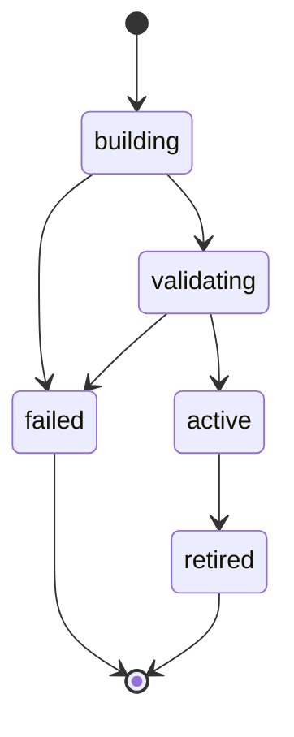

# API and Data Contracts

## Status

Proposed contracts for the first single-tenant release. These contracts define
the boundary the vertical slice must implement; they are not an implementation.

## Conventions

- Public HTTP JSON uses `camelCase`.
- Python code uses `snake_case`; Pydantic aliases map the two forms.
- Timestamps use RFC 3339 UTC strings, for example
  `2026-08-22T18:30:00Z`.
- Public identifiers are opaque strings or UUIDs. Clients must not extract
  meaning from them.
- Unknown input fields are rejected at trust boundaries.
- Public responses never contain embedding vectors, prompts, model credentials,
  session hashes, internal distances, or unredacted telemetry.
- API-breaking changes require a new URL version. Additive fields may be added
  within `/v1`, so clients must ignore unknown response fields.

## HTTP API

### `GET /healthz`

Liveness check. It confirms that the process and HTTP stack can respond. It does
not call Firestore or Vertex AI.

Response: `200 OK`

```json
{
  "status": "ok"
}
```

### `GET /readyz`

Readiness check. It confirms that required configuration is valid, dependency
clients can be constructed, and an active knowledge version can be read. It
does not make a paid generation call.

Ready response: `200 OK`

```json
{
  "status": "ready",
  "knowledgeVersion": "01J5MVP8N4A7G6W51K8G02S3CX"
}
```

Not-ready response: `503 Service Unavailable` using the problem contract. The
response must not reveal project IDs, collection names, credentials, or vendor
exception messages.

### `POST /v1/ask`

Answers one visitor question from the active verified knowledge version.

Request:

```json
{
  "question": "How was Project Atlas deployed?",
  "sessionId": "optional-browser-generated-id"
}
```

Validation:

| Field | Rule |
| --- | --- |
| `question` | Required string; trim surrounding whitespace; 3–500 Unicode characters after trimming |
| `sessionId` | Optional opaque string; 1–128 characters; never persisted directly |

An answered response: `200 OK`

```json
{
  "requestId": "01J5MW1Q5RHH9T5CDW8G9VCA9Y",
  "answer": "Project Atlas was packaged with Docker and deployed to Cloud Run.",
  "answerStatus": "answered",
  "citations": [
    {
      "sourceId": "project-atlas",
      "title": "Project Atlas",
      "url": "/projects/atlas"
    }
  ],
  "knowledgeVersion": "01J5MVP8N4A7G6W51K8G02S3CX"
}
```

An insufficient-evidence response is also `200 OK` because the request was
valid and the knowledge gap is a normal product result:

```json
{
  "requestId": "01J5MW2N5C4PAVYVD1V1MJX3H9",
  "answer": "I don't have verified information about that.",
  "answerStatus": "knowledge_gap",
  "citations": [],
  "knowledgeVersion": "01J5MVP8N4A7G6W51K8G02S3CX"
}
```

`answerStatus` is one of:

- `answered`: every substantive claim is supported by returned citations.
- `partial`: reserved for a later evidence policy that can prove claim-level
  coverage. The first slice does not emit it.
- `knowledge_gap`: verified evidence is absent or insufficient; citations must
  be empty and the answer uses application-owned abstention text.

### `POST /v1/feedback`

Records optional feedback for a prior answer. It is part of the planned `/v1`
surface but is not required by the first vertical slice.

Request:

```json
{
  "requestId": "01J5MW1Q5RHH9T5CDW8G9VCA9Y",
  "helpful": false,
  "reason": "missing_information"
}
```

`reason` is optional and one of `incorrect`, `missing_information`,
`unclear`, or `other`. No free-text comment is accepted in the first release.

Response: `202 Accepted`

```json
{
  "status": "accepted"
}
```

Feedback is telemetry. It cannot alter an answer, knowledge chunk, or active
knowledge version.

### `POST /v1/owner/insights/report`

Generates and stores a bounded insight report from privacy-reduced questions.
It requires an owner bearer token and accepts an inclusive start/exclusive end
period of no more than 31 days.

```json
{
  "periodStart": "2026-08-17T00:00:00Z",
  "periodEnd": "2026-08-24T00:00:00Z"
}
```

The response contains `analyzedQuestionCount`, the configured
`minimumQuestionCount`, and repeated `insights`. Authentication failure returns
a generic `401` problem response. The endpoint never returns individual
questions or session hashes.

## Error contract

Transport, validation, dependency, and rate-limit failures use
`application/problem+json` with a stable application code.

```json
{
  "type": "https://folioaware.dev/problems/question-too-long",
  "title": "Question exceeds the allowed length",
  "status": 422,
  "code": "QUESTION_TOO_LONG",
  "requestId": "01J5MW4XR0NGKZGK74FQVPC8E0"
}
```

Expected codes include:

| HTTP status | Application code | Meaning |
| --- | --- | --- |
| `400` | `INVALID_REQUEST` | Malformed JSON or request shape |
| `422` | `INVALID_QUESTION` | Question fails content constraints |
| `422` | `QUESTION_TOO_LONG` | Normalized question exceeds the limit |
| `429` | `RATE_LIMITED` | Request budget exceeded |
| `503` | `KNOWLEDGE_UNAVAILABLE` | Active knowledge cannot be read |
| `503` | `MODEL_UNAVAILABLE` | Required model dependency failed or timed out |
| `500` | `INVALID_MODEL_OUTPUT` | Model output failed closed during validation |

Internal exception text, prompts, retrieved passages, stack traces, and vendor
payloads are logged only through a redacting logger and are never returned.

## Public API models

### `AskRequest`

| Field | Type | Required | Notes |
| --- | --- | --- | --- |
| `question` | string | yes | Original question is processed in memory; the persisted copy is redacted |
| `sessionId` | string or null | no | Hashed with a rotating server secret before persistence |

### `AskResponse`

| Field | Type | Required | Notes |
| --- | --- | --- | --- |
| `requestId` | string | yes | Correlates response, safe logs, and optional feedback |
| `answer` | string | yes | Validated answer or application-owned abstention |
| `answerStatus` | enum | yes | `answered`, `partial`, or `knowledge_gap` |
| `citations` | array of `Citation` | yes | Non-empty for substantive `answered` responses |
| `knowledgeVersion` | string | yes | Exact version used for retrieval |

### `Citation`

| Field | Type | Required | Notes |
| --- | --- | --- | --- |
| `sourceId` | string | yes | Stable approved source identifier |
| `title` | string | yes | Owner-approved public label |
| `url` | string | yes | HTTPS URL or root-relative path; other schemes are rejected |

The public citation is built from stored verified metadata. The generative model
may reference an allowed evidence ID but may not supply citation titles or URLs.

## Approved-source contract

The `folioaware.yaml` manifest selects approved source files. Every loaded
record is validated into this canonical shape before chunking:

```json
{
  "schemaVersion": 1,
  "sourceId": "project-atlas",
  "sourceType": "project",
  "title": "Project Atlas",
  "citationUrl": "/projects/atlas",
  "content": "Project Atlas is a synthetic inventory forecasting service...",
  "tags": ["python", "fastapi", "cloud-run"],
  "visibility": "public"
}
```

Rules:

- `sourceId` matches `^[a-z0-9]+(?:-[a-z0-9]+)*$` and is unique.
- `schemaVersion` must be supported; unknown versions fail closed.
- `sourceType` is `project`, `experience`, `skill`, `education`, or `profile`.
- `title` is 1–120 characters.
- `citationUrl` is an HTTPS URL or a root-relative path beginning with `/`.
- `content` is non-empty and bounded before parsing/chunking.
- `tags` are optional normalized labels, not verified claims by themselves.
- Only `public` visibility is retrievable by the public answer API.
- Approval comes from manifest inclusion on the synchronized Git revision, not
  from a record declaring itself verified.

## Persistence contracts

Persistence documents use `snake_case` field names. Firestore-specific values
are converted inside the Google adapter.

### `knowledge_chunks`

```json
{
  "chunk_id": "project-atlas:0001:4fd95b5d",
  "source_id": "project-atlas",
  "content": "Project Atlas was packaged with Docker and deployed to Cloud Run.",
  "content_hash": "sha256:4fd95b5d...",
  "citation_title": "Project Atlas",
  "citation_url": "/projects/atlas",
  "evidence_status": "verified",
  "visibility": "public",
  "embedding": [0.031, -0.144, 0.502],
  "embedding_model": "configured-embedding-model",
  "embedding_task_type": "RETRIEVAL_DOCUMENT",
  "embedding_dimensions": 768,
  "index_version": "01J5MVP8N4A7G6W51K8G02S3CX",
  "active": true,
  "created_at": "2026-08-22T18:00:00Z",
  "updated_at": "2026-08-22T18:00:00Z"
}
```

Invariants:

- `chunk_id` is deterministic for the same source and chunk boundary.
- `content_hash` covers canonical content and citation-relevant metadata.
- Embeddings are reusable only when hash, model, task type, dimensions, and
  normalization contract match.
- Only candidate synchronization writes create knowledge chunks.
- The public API receives a read-only knowledge-repository capability.

### `index_versions`

```json
{
  "index_version": "01J5MVP8N4A7G6W51K8G02S3CX",
  "git_commit": "0123456789abcdef",
  "status": "active",
  "source_count": 3,
  "chunk_count": 9,
  "embedding_model": "configured-embedding-model",
  "embedding_dimensions": 768,
  "created_at": "2026-08-22T18:00:00Z",
  "activated_at": "2026-08-22T18:05:00Z"
}
```

`status` transitions are:



Only one index version is active. Activation is transactional: a successful
candidate becomes active as the previous version becomes retired. A failure
cannot change the existing active version.

### `sync_runs`

```json
{
  "sync_run_id": "01J5MVM7DN0P0M8NQW7D2JXSHH",
  "candidate_index_version": "01J5MVP8N4A7G6W51K8G02S3CX",
  "git_commit": "0123456789abcdef",
  "status": "succeeded",
  "sources_seen": 3,
  "chunks_added": 2,
  "chunks_reused": 7,
  "chunks_removed": 1,
  "started_at": "2026-08-22T18:00:00Z",
  "completed_at": "2026-08-22T18:05:00Z",
  "error_code": null
}
```

`status` is `running`, `succeeded`, or `failed`. Sanitized error codes are
stored; credentials, full vendor errors, and source contents are not.

### `visitor_questions`

```json
{
  "question_id": "01J5MW1Q5RHH9T5CDW8G9VCA9Y",
  "redacted_question": "Has this developer worked with Kafka?",
  "session_hash": "hmac-sha256:rotating-key-id:digest",
  "intent": "skill_verification",
  "topics": ["apache-kafka"],
  "answer_status": "knowledge_gap",
  "knowledge_version": "01J5MVP8N4A7G6W51K8G02S3CX",
  "created_at": "2026-08-22T18:30:00Z",
  "expires_at": "2026-11-20T18:30:00Z"
}
```

`intent` is `skill_verification`, `project_experience`, `architecture`,
`availability`, or `unknown`.

The record must never contain raw IP addresses, raw `sessionId`, credentials,
the generated answer, or unredacted request headers. This collection is never a
retrieval source for answering.

### `feedback`

```json
{
  "feedback_id": "01J5MW8FCVHW5X8YH88W9V77JQ",
  "request_id": "01J5MW1Q5RHH9T5CDW8G9VCA9Y",
  "helpful": false,
  "reason": "missing_information",
  "created_at": "2026-08-22T18:35:00Z"
}
```

Feedback cannot modify the original question record or any knowledge document.

### `topic_insights`

Implemented by the deterministic insight-aggregation slice:

```json
{
  "insight_id": "apache-kafka:2026-W34",
  "topic": "apache-kafka",
  "period_start": "2026-08-17T00:00:00Z",
  "period_end": "2026-08-24T00:00:00Z",
  "distinct_session_count": 4,
  "question_count": 7,
  "skill_verification_count": 7,
  "knowledge_gap_count": 6,
  "suggested_action": "build_project",
  "created_at": "2026-08-24T01:00:00Z"
}
```

`suggested_action` is `add_existing_evidence`, `build_project`, `study_topic`,
or `leave_unavailable`. It is a recommendation, never a verified claim.

## Internal generation contracts

The generator receives only a bounded question and the evidence selected by the
application:

```json
{
  "question": "How was Project Atlas deployed?",
  "knowledgeVersion": "01J5MVP8N4A7G6W51K8G02S3CX",
  "evidence": [
    {
      "evidenceId": "project-atlas:0001:4fd95b5d",
      "content": "Project Atlas was packaged with Docker and deployed to Cloud Run."
    }
  ]
}
```

The model returns an untrusted candidate:

```json
{
  "answer": "Project Atlas was packaged with Docker and deployed to Cloud Run.",
  "evidenceIds": ["project-atlas:0001:4fd95b5d"]
}
```

The citation validator requires every candidate evidence ID to be a member of
the exact retrieved set. It then builds public citations from verified stored
metadata. Unknown IDs, invalid JSON, empty evidence references, or output-limit
violations fail closed.

## Port contracts

The implementation will express these as narrow Python `Protocol` interfaces.
Method names may evolve during implementation, but the behavior is binding.

### Embeddings

- Embed approved chunks using the document retrieval task type.
- Embed questions using the query retrieval task type.
- Return exactly the configured number of finite numeric dimensions.
- Never silently truncate an input; reject or explicitly chunk first.
- Surface timeout, rate-limit, invalid-input, and unavailable errors distinctly.

### Knowledge repository

- Read the single active index version.
- Search only public, verified, active chunks in a specified version.
- Return evidence with distance and verified citation metadata.
- Build candidate versions without changing the active pointer.
- Activate a validated candidate atomically.
- Never expose a knowledge-write capability to the public answer use case.

### Generation

- Accept only the bounded generation request contract.
- Return the untrusted structured candidate contract.
- Enforce configured model, prompt version, schema version, timeout, and output
  token limit.
- Perform no retrieval, web search, tool call, or knowledge write.

### Question repository

- Accept only an already-redacted question record.
- Persist no raw request, IP address, user agent, or browser identifier.
- Apply retention metadata on every record.
- Have no dependency on or access to the knowledge repository.

## Cross-contract invariants

1. `answered` requires at least one validated citation.
2. `knowledge_gap` requires an empty citation list and application-owned text.
3. Every returned citation belongs to evidence retrieved for the same request
   and knowledge version.
4. Model output, visitor input, telemetry, feedback, and insights cannot satisfy
   the approved-source contract.
5. Only a validated synchronization can activate an index version.
6. The public answer use case cannot obtain a knowledge-write dependency.
7. Telemetry failure does not change an answer's evidence status; it is handled
   and observed separately.
8. Duplicate feedback for the same request and client should be idempotent.
9. Configuration, model, prompt, schema, and knowledge versions are observable
   without exposing secrets.
10. All persistence writes use server-generated timestamps and identifiers.

## First-slice contract subset

The smallest implementation must support:

- `GET /healthz`
- `POST /v1/ask`
- `AskRequest`, `AskResponse`, `Citation`, and problem responses
- approved source, knowledge chunk, index version, sync run, and redacted
  visitor-question models
- embedding, generation, knowledge-repository, and question-repository ports
- in-memory adapters
- `answered` and `knowledge_gap` outcomes

Readiness, feedback, partial answers, cloud deployment, and notifications follow
in later bounded changes. Google adapters and deterministic topic insights are
implemented.

