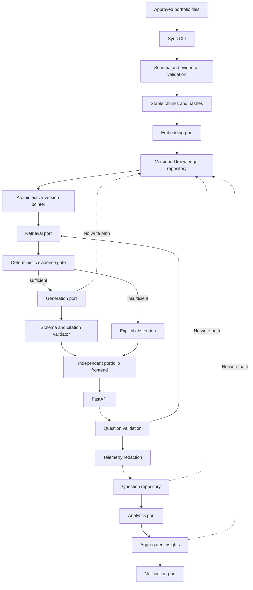

# FolioAware Architecture

## Status

Proposed architecture for the first single-tenant release. The decisions in
[`docs/adr`](adr/) must be revisited when their recorded assumptions stop being
true.

## System shape

FolioAware has three independently invoked workflows:

1. **Synchronization** converts explicitly approved portfolio files into a new,
   validated knowledge version and atomically activates it.
2. **Answering** retrieves evidence from the active version and either returns a
   citation-validated answer or abstains.
3. **Insights** processes privacy-reduced question telemetry separately and can
   recommend owner actions, but cannot write verified knowledge.

## Trust boundaries

- Only the sync workflow can write a candidate knowledge version.
- Only successful validation can move the active-version pointer.
- The public API can read active knowledge and write sanitized telemetry; it
  cannot write knowledge or change the active version.
- The insight workflow can read telemetry and write aggregates; it cannot read
  credentials from clients or mutate verified knowledge.
- Retrieved content and model output are untrusted even when the source content
  was approved. Both remain subject to application validation.
- The browser receives answers and public citations, never Vertex AI or Google
  Cloud credentials.

## Logical components

| Component | Owns | Does not own |
| --- | --- | --- |
| API | HTTP validation, dependency wiring, response mapping | Retrieval policy or persistence details |
| Ingestion | Source parsing, schema validation, chunking, hashing | Active-version mutation without validation |
| Synchronization | Change plan, embedding changed chunks, activation | Answering or telemetry |
| Retrieval | Active-version filtering, nearest-neighbor query, evidence gate | Answer prose generation |
| Generation | Constrained request and typed candidate response | Choosing or inventing sources |
| Citations | Citation membership and response validation | Model invocation |
| Telemetry | Redaction, retention metadata, question persistence | Verified knowledge writes |
| Analytics | Topic/intent aggregation and gap detection | Fact creation |
| Notifications | Delivery of owner nudges | Deciding verified claims |
| Repositories | Typed persistence operations | Product-policy decisions |

## Deployment units

The MVP has one Cloud Run API service and one sync CLI invoked by GitHub
Actions. Insights begin as an explicit CLI/job entry point and need not be a
continuously running service. All are single-tenant per deployment and share a
configured Firestore database and Vertex AI project/location.

No deployment resources are created until the owner separately approves the
cloud phase.

## Decision index

1. [ADR-0001: Deterministic application pipeline](adr/0001-deterministic-application-pipeline.md)
2. [ADR-0002: Explicit manifest approval boundary](adr/0002-explicit-manifest-approval-boundary.md)
3. [ADR-0003: Copy-on-write knowledge versions](adr/0003-copy-on-write-knowledge-versions.md)
4. [ADR-0004: Firestore with separated collections and ports](adr/0004-firestore-separated-collections-and-ports.md)
5. [ADR-0005: Evidence-gated generation and application-owned citations](adr/0005-evidence-gated-generation-and-citations.md)
6. [ADR-0006: Privacy-reduced telemetry as a separate data plane](adr/0006-privacy-reduced-telemetry.md)
7. [ADR-0007: Cloud Run and keyless GitHub Actions](adr/0007-cloud-run-and-keyless-ci.md)

## Current platform references

- [Firestore vector search](https://docs.cloud.google.com/firestore/native/docs/vector-search)
- [Vertex AI text embeddings](https://docs.cloud.google.com/vertex-ai/generative-ai/docs/embeddings/get-text-embeddings)
- [Vertex AI structured generation configuration](https://cloud.google.com/vertex-ai/generative-ai/docs/reference/rest/v1beta1/GenerationConfig)
- [Cloud Run service configuration](https://docs.cloud.google.com/run/docs/configuring)
- [Workload Identity Federation for deployment pipelines](https://docs.cloud.google.com/iam/docs/workload-identity-federation-with-deployment-pipelines)

