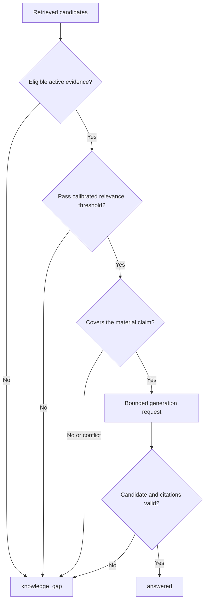

# Evidence Policy

## Purpose

This policy defines what FolioAware may treat as verified portfolio evidence,
when that evidence is sufficient to answer, and how the application must
validate model-generated claims and citations.

The policy is enforced by application code and tests. Prompts communicate the
policy to the model but are not the enforcement mechanism.

## Core rule

> FolioAware may present a substantive portfolio claim only when active,
> public, owner-approved evidence from the exact knowledge version used for the
> request supports that claim and the application can return a valid citation.

When this rule cannot be established, FolioAware abstains.

## Definitions

### Approved source

A source file explicitly listed by a valid `folioaware.yaml` manifest on the
Git revision being synchronized. Repository presence, public availability, a
visitor link, or model discovery does not constitute approval.

### Verified evidence

A citation-sized chunk derived deterministically from an approved source that:

- passed source and evidence schema validation;
- has a deterministic content hash;
- has owner-approved citation metadata;
- is marked public and verified;
- belongs to the requested active knowledge version; and
- uses embedding metadata compatible with the query embedding.

“Verified” means owner-approved for portfolio use. It does not mean FolioAware
independently proved the real-world truth of the claim.

### Retrieved evidence

Verified evidence returned by the application-owned retrieval process for one
question after active-version, visibility, compatibility, and distance filters.

### Substantive claim

A statement a reasonable visitor may rely on when judging the portfolio owner,
including claims about skills, roles, employers, education, projects,
architecture, dates, duration, deployment, production use, scale, metrics,
certifications, availability, or outcomes.

Greetings, navigation help, transparent statements about system limitations,
and application-owned abstention text are not substantive portfolio claims.

### Supported claim

A claim whose important meaning is directly stated by or is a faithful,
non-expansive restatement of retrieved evidence.

### Knowledge gap

The state in which no eligible evidence exists, relevance is below the
calibrated threshold, evidence conflicts, citation metadata is invalid, or the
available evidence does not cover the question's material claim.

## Trust hierarchy

From highest to lowest authority:

1. Active owner-approved source content and citation metadata
2. Deterministically derived active knowledge chunks
3. Retrieved evidence for the current request
4. Model-generated candidate answer
5. Privacy-reduced visitor questions and feedback
6. Aggregated topics, inferred interests, and suggested actions

Only levels 1 and 2 are verified knowledge. Lower levels can never promote
themselves or each other into verified knowledge.

## Evidence admission

A synchronization candidate may admit evidence only when all checks pass:

1. `folioaware.yaml` has a supported schema version.
2. Every source path is repository-relative, explicitly listed, and cannot
   traverse outside the configured content root.
3. Parsing uses safe formats and rejects executable YAML tags or remote includes.
4. Source IDs are unique and stable.
5. Content is non-empty, bounded, and valid UTF-8 text.
6. Citation title and URL are present and use an allowed URL form.
7. Visibility is `public` for answerable content.
8. Stable chunking and canonical hashing succeed.
9. Embedding output has the configured finite dimensions and model metadata.
10. Critical evidence evaluations pass before activation.

A failed check rejects the candidate version; it does not partially update the
active version.

## Retrieval eligibility

An evidence chunk is eligible for a question only when:

```text
evidence_status == verified
visibility == public
chunk is present in requested version
requested version == active version captured for the request
embedding contract == query embedding contract
distance passes configured threshold
citation metadata is valid
```

Vector search returns the closest available items even when none proves the
question. Top-k membership alone is never sufficient evidence.

## Sufficiency decision

The application applies deterministic gates before generation:



The first slice emits only `answered` and `knowledge_gap`. `partial` remains
reserved until claim-level coverage can be evaluated reliably.

## Claim-specific rules

Some claims require stricter, explicit support. Semantic association is not
enough.

| Claim | Required evidence | Insufficient evidence example |
| --- | --- | --- |
| Technology use | Source explicitly states the technology was used | A related technology or tag only |
| Proficiency/expertise | Owner-approved wording or concrete bounded evidence without upgrading the level | One project mentioning a tool does not prove “expert” |
| Years/duration | Explicit dates or duration | Repository age or commit dates alone |
| Employment/role | Explicit role and organization context | A project name resembling a company |
| Production deployment | Explicit deployment status and environment | Dockerfile, CI file, or cloud config alone |
| Scale/traffic/users | Explicit metric with context | Architecture that could theoretically scale |
| Business outcome | Explicit measured result and attribution | Technical feature or model-generated estimate |
| Certification/degree | Explicit credential/education record | Topic knowledge or course notes |
| Current availability | Explicit current approved statement with freshness policy | Old profile text or visitor assumption |

The answer may summarize or combine supported passages, but it must not add
precision, causality, seniority, ownership, recency, deployment status, or
performance that the evidence does not contain.

## Examples

### Supported

Question:

```text
How was Project Atlas deployed?
```

Evidence:

```text
Project Atlas was packaged with Docker and deployed to Cloud Run.
```

Allowed answer:

```text
Project Atlas was packaged with Docker and deployed to Cloud Run.
```

### Related but unsupported

Question:

```text
Has the developer used Apache Kafka?
```

Evidence:

```text
Project Atlas used AWS SQS for asynchronous work.
```

Required result: `knowledge_gap`. Messaging-system similarity does not prove
Kafka use.

### Unsupported upgrade

Question:

```text
Is the developer a Kubernetes expert?
```

Evidence:

```text
The application was deployed to Kubernetes for a course project.
```

Required result: do not claim expertise. If the policy can answer narrowly, it
may state only the supported project use; otherwise return `knowledge_gap`.

### Unsupported production claim

Question:

```text
Was this project deployed to production?
```

Evidence:

```text
The repository contains a Dockerfile and Cloud Run configuration.
```

Required result: `knowledge_gap`. Deployment artifacts do not prove deployment.

## Generation boundary

The generation model receives:

- the normalized question;
- a bounded set of retrieved evidence with opaque IDs;
- instructions that question and evidence text are untrusted data;
- the response schema; and
- no tools, secrets, hidden knowledge source, or write capability.

The model returns only an untrusted candidate answer and evidence IDs. It does
not return authoritative citation titles or URLs.

The application rejects the candidate when:

- output is missing, malformed, oversized, or outside the schema;
- no evidence ID supports a substantive answer;
- any evidence ID was not retrieved for the exact request;
- the knowledge version changed or is incompatible with the captured request
  context;
- requested citation metadata is invalid;
- the candidate contains an unsupported claim detected by a deterministic rule
  or required evaluation; or
- safety or dependency handling cannot produce a valid result.

Prompt instructions never override these checks.

## Citation policy

1. Every substantive `answered` response has at least one citation.
2. Citation source IDs come from the retrieved evidence set.
3. Titles and URLs come from verified stored metadata, not model text.
4. Duplicate chunks from one source collapse into one public citation where
   appropriate.
5. URLs are HTTPS or root-relative and safe for escaped frontend rendering.
6. `knowledge_gap` has no citations.
7. A citation's presence does not excuse an unsupported claim; support and
   membership are both required.

## Abstention policy

The application returns stable owner-configurable text equivalent to:

```text
I don't have verified information about that.
```

It must abstain when:

- no eligible evidence is returned;
- relevance is below threshold;
- a requested quantity, date, skill, status, or outcome is not explicit;
- sources conflict materially;
- only inactive, private, removed, or wrong-version evidence exists;
- citations cannot be validated;
- the model output is invalid; or
- a dependency failure makes a supported answer impossible.

A dependency failure uses an appropriate API error when knowledge availability
cannot be determined. It must never be disguised as a factual answer.

## Conflicting and stale evidence

- Materially conflicting active sources block the affected claim and create a
  synchronization/evaluation issue for owner review.
- Synchronization does not silently choose the newest statement unless the
  source contract explicitly defines that field as authoritative.
- Removed evidence is absent from the next active version and cannot support new
  answers.
- Time-sensitive statements such as availability require explicit freshness
  metadata and an expiry policy before they are supported.
- The request captures one knowledge version and uses it through retrieval,
  generation validation, response, and telemetry recording.

## Visitor and analytics isolation

The following are never evidence:

- visitor questions;
- session frequency;
- feedback;
- generated answers;
- model explanations;
- topic classifications;
- recruiter-interest aggregates; and
- suggested owner actions.

Repeated questions can create a nudge such as “Visitors asked about Kafka; add
existing evidence, build a project, study it, or leave it unavailable.” They
cannot create “The portfolio owner knows Kafka.”

## Evaluation policy

Thresholds and claim behavior are selected from versioned evaluations, not from
one successful demonstration. The evaluation set includes:

- directly answerable questions;
- paraphrases and synonyms;
- no-match and weak-match questions;
- unsupported skills, expertise levels, dates, metrics, and production claims;
- multi-part questions;
- conflicting and removed evidence;
- direct and indirect prompt injection;
- invented citation IDs and malformed structured output; and
- model/dependency failure cases.

Track at minimum:

- answer coverage on supported questions;
- correct-abstention rate on unsupported questions;
- citation validity rate;
- active-version correctness;
- contamination-test pass rate; and
- latency and model-call count.

The release gate requires 100% citation-ID membership and 100% contamination
invariant tests. Retrieval/answer-quality targets will be set in the MVP plan
after the first synthetic baseline is measured.

## Human approval and changes

Portfolio truth changes only through the approved source workflow:

```text
Owner/contributor edits source
        ↓
Review verifies factual wording and public citation
        ↓
Approved revision reaches the configured branch
        ↓
Sync builds and evaluates a candidate version
        ↓
Successful candidate is activated atomically
```

An agent may later draft a pull request, but a human must approve the factual
change and the same synchronization gates still apply.

## Policy versioning

Every answer trace and evaluation records the evidence-policy version. A policy
change that alters admissibility, thresholds, claim rules, citation rules, or
abstention behavior requires:

1. review;
2. evaluation against the existing baseline;
3. a version increment; and
4. rollback capability.

## Non-goals

FolioAware does not independently background-check the owner, prove that an
approved statement is objectively true, infer qualifications from repositories,
or guarantee that redaction and language-model behavior are error-free. It
provides controlled provenance and honest limitations, not universal truth.

