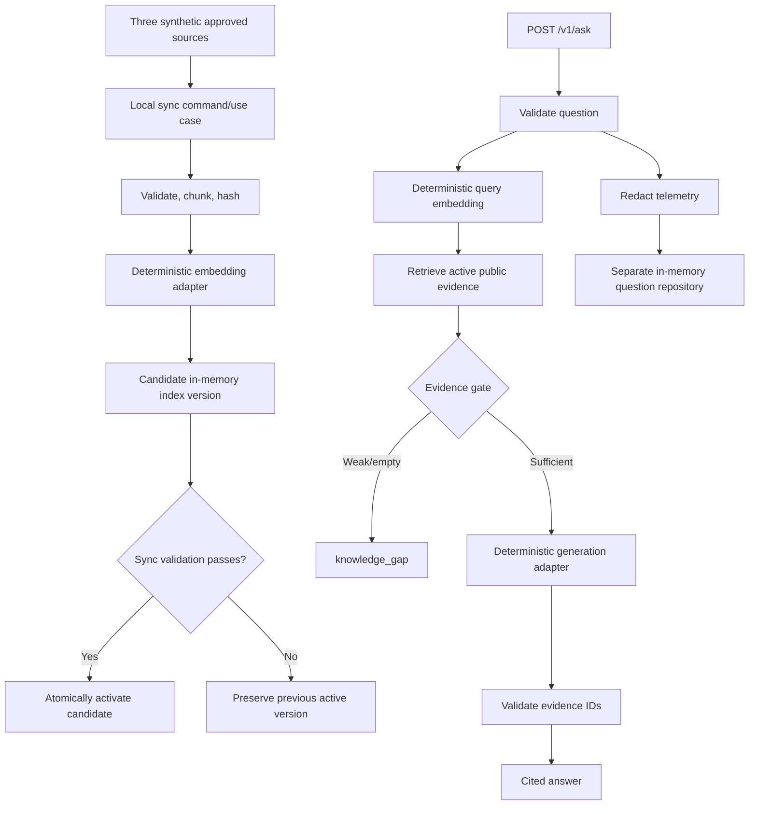

# MVP Vertical-Slice Plan

## Goal

Build the smallest locally runnable FolioAware slice that proves the core trust
claim:

> Given approved synthetic portfolio content and a visitor question, FolioAware
> returns either an answer citing evidence retrieved from the active knowledge
> version or an explicit knowledge gap, while storing only privacy-reduced
> telemetry in a separate repository.

The slice also proves that synchronization is idempotent and that a failed
candidate cannot replace the active knowledge version.

## Why this is the first slice

The highest-risk part of FolioAware is not serving HTTP or calling a model. It
is preserving provenance across source approval, synchronization, retrieval,
generation, citation validation, and telemetry storage. This slice crosses all
of those boundaries with deterministic local adapters so failures are cheap,
repeatable, and observable before cloud integration.

## Branch and delivery unit

Implementation branch:

```text
feature/local-rag-vertical-slice
```

The branch is one reviewable vertical slice with several coherent commits. It
does not mix real Google adapters or deployment changes into the local proof.

## End-to-end demonstration



The deterministic adapters simulate the contracts of Vertex AI and Firestore;
they are not presented as production AI behavior.

## Synthetic portfolio fixture

Use exactly three fictional public records:

1. **Project Atlas** — a FastAPI inventory forecasting API, packaged with
   Docker and deployed to Cloud Run.
2. **Project Lantern** — a data-quality monitoring tool using Python and
   PostgreSQL.
3. **Project Meadow** — an accessible static community-garden website with no
   cloud or messaging claim.

The fixture must contain no real person, employer, portfolio analytics,
credential, email address, or private URL. Apache Kafka is intentionally absent
to provide the canonical knowledge-gap question.

Initially, each short source becomes one citation-sized chunk. General-purpose
multi-chunk Markdown segmentation is deferred until a fixture demonstrates that
one-source/one-chunk behavior is insufficient.

## Included behavior

### Project foundation

- Root `pyproject.toml` with application and development dependency groups
- Reproducible `uv.lock`
- `src/folioaware` package layout
- `.python-version`, `.gitignore`, `.dockerignore`, and credential-free
  `.env.example`
- Ruff linting and formatting, mypy strict-enough type checks, and pytest
- Multi-stage or otherwise minimal non-root Docker image
- GitHub Actions CI for lock consistency, lint, format, types, tests, and image
  build
- Local setup, test, and demo instructions in `README.md`

Exact runtime and dependency versions are selected and verified when the branch
starts; no stale version numbers are invented in this planning document.

### Domain and contracts

- Approved source, citation, knowledge chunk, embedding metadata, evidence,
  index version, sync result, redacted question, candidate answer, and final
  answer models
- Strict enums and field constraints aligned with
  `docs/api-and-data-contracts.md`
- Explicit domain exceptions that entry points can map without exposing
  internal details
- Immutable domain values where mutation would weaken auditability

### Ports

- Document/query embedding provider
- Generation provider
- Read/write synchronization repository capability
- Read-only answer-time knowledge repository capability
- Question telemetry repository
- Clock and identifier sources only if nondeterminism otherwise makes tests
  unreliable

Knowledge read and write capabilities remain distinct protocols even when the
in-memory adapter implements both.

### Local synchronization

- Load the versioned synthetic manifest and explicitly referenced sources
- Reject absolute paths, traversal, duplicate IDs, invalid URLs, unsupported
  schema versions, unknown fields, and empty/oversized content
- Produce stable canonical content hashes and chunk IDs
- Reuse an existing embedding when the complete embedding compatibility key
  matches
- Create a candidate knowledge version
- Run deterministic validation before activation
- Atomically replace the active-version pointer in the in-memory repository
- Retain the previous version after candidate failure
- Record counts for added, reused, removed, and failed chunks
- Expose the use case as a local CLI command or a directly invokable module;
  finalize command spelling during implementation

### Question answering

- `GET /healthz`
- `POST /v1/ask`
- Question normalization and 3–500-character validation
- Deterministic query embedding
- Active/public/verified/version-compatible retrieval with bounded top-k
- Evaluation-configured local relevance threshold
- No generation call below the threshold
- Structured candidate generation using only supplied evidence IDs
- Exact retrieved-set citation membership validation
- Application-owned public citation title and URL
- Stable application-owned knowledge-gap text
- `answered` and `knowledge_gap` outcomes only
- Structured `application/problem+json` errors without internal details

### Privacy-reduced telemetry

- Redact common email addresses and phone-number-like values before persistence
- Hash optional session identifiers with HMAC and a development-only configured
  secret; persist no raw session ID
- Store question ID, redacted question, answer status, knowledge version, and
  timestamps in a dedicated in-memory repository
- Store neither generated answer nor raw request metadata
- Treat telemetry failure separately from evidence validation

The redactor is a risk-reduction mechanism, not a guarantee of anonymity. Its
limitations must be documented and tested.

## Deliberately excluded

- Firestore and Vertex AI production adapters
- Google Cloud project, index, service account, IAM, or billing changes
- Cloud Run deployment or infrastructure application
- GitHub Workload Identity Federation configuration
- `/readyz` dependency probing
- `/v1/feedback`
- `partial` answers
- Model-based intent/topic classification
- Insight aggregation, dashboard, digest, or notifications
- General web scraping, CMS adapters, or remote manifest includes
- Framework-independent widget or React package
- LangChain, LangGraph, tools, autonomous loops, or multi-agent behavior
- Streaming responses, chat memory, and cross-question conversation state
- Multi-tenancy

These exclusions keep the branch focused on the evidence and data-separation
architecture rather than cloud plumbing or product breadth.

## Planned implementation sequence

### Commit 1: Project foundation

Create the package, tool configuration, lock, container, CI, environment
example, and one health endpoint test. Verification: all configured quality
commands run locally, even though most packages are initially empty.

### Commit 2: Domain contracts and ports

Implement strict domain models and narrow protocols with unit tests for valid
and invalid records. No FastAPI handler reaches a concrete vendor SDK.

### Commit 3: Synthetic ingestion and versioned local synchronization

Add the three fixtures, safe manifest loading, stable chunking/hashing,
deterministic document embeddings, candidate versions, activation, reuse, and
rollback tests.

### Commit 4: Local answer vertical path

Add deterministic retrieval, the evidence gate, deterministic candidate
generation, citation validation, the application use case, dependency wiring,
and `/v1/ask` integration tests.

### Commit 5: Telemetry and adversarial hardening

Add redaction/session hashing, isolated storage, structured failures, injection
fixtures, contamination tests, documentation, and the final container/CI smoke
checks.

Commits are implementation checkpoints, not separate deployment releases. If a
later commit reveals a contract flaw, update the owning contract and tests in
the same branch rather than coding around it.

## Test plan

### Domain and schema

- Valid synthetic source
- Missing/invalid source ID, content, visibility, and citation URL
- Unknown source field or schema version
- Duplicate source ID
- Absolute/traversing path
- Invalid embedding dimensions or non-finite values

### Synchronization

- Initial three-source synchronization activates one complete version
- Repeating an unchanged sync reuses all embeddings
- Changing one source re-embeds only its changed chunk
- Removing a source makes it unavailable in the next active version
- Failed validation leaves the previous version active
- Candidate counts and Git/version metadata are correct
- Concurrent activation attempt is rejected or serialized deterministically

### Retrieval and answering

- Atlas deployment question retrieves Atlas and returns one valid citation
- Lantern database question retrieves Lantern and returns one valid citation
- Kafka question returns `knowledge_gap` with no generation call
- Weak match returns `knowledge_gap`
- Empty active index returns a safe result/error according to the contract
- Candidate with unknown citation ID is rejected
- Candidate with no evidence IDs is rejected
- Wrong-version, private, inactive, or removed evidence is excluded
- Oversized and whitespace-only questions are rejected
- Model timeout and knowledge repository failure map to safe structured errors

### Injection and output handling

- Question containing “ignore previous instructions” cannot create an answer
  without eligible evidence
- Evidence containing instructions cannot grant tools or introduce an unknown
  citation
- Model candidate cannot inject an arbitrary URL or HTML citation
- Malformed, oversized, empty, or extra-field model candidates fail closed
- Returned text is JSON data and is not rendered as trusted HTML

### Data separation and privacy

- Visitor question never appears in the knowledge repository
- Generated answer never appears in verified knowledge or telemetry
- Email and phone examples are redacted before persistence
- Raw session ID is absent; only the HMAC form is stored
- Telemetry failure cannot turn weak evidence into an answer
- Analytics/telemetry objects do not satisfy approved-source validation

### Entry points and operations

- `/healthz` returns `200`
- `/v1/ask` supported and gap responses match the public JSON contract
- Problem responses contain no stack trace, prompt, evidence, or secret
- Container starts as non-root and serves `/healthz`
- CI commands produce the same result as documented local commands

## Acceptance criteria

The branch is complete only when:

1. All committed dependencies are locked reproducibly.
2. Ruff lint and format checks pass.
3. Mypy passes for application code.
4. Unit and integration tests pass without network or cloud credentials.
5. The Docker image builds and its health endpoint passes a smoke test.
6. Three synthetic sources synchronize into one active local version.
7. An Atlas question returns an answer with an application-validated Atlas
   citation.
8. A Kafka question returns `knowledge_gap` and does not call generation.
9. An invented citation ID is never returned to the client.
10. Unchanged content is not re-embedded.
11. Removed content stops appearing after successful activation.
12. A failed candidate leaves the previous active version usable.
13. Visitor-derived data cannot be inserted through the knowledge interfaces.
14. Fixtures and logs contain no private portfolio data or credentials.
15. No billable cloud resource or external deployment is created.

## Quality and evaluation targets

Deterministic invariants have zero-tolerance targets:

- Citation membership: 100%
- Telemetry-to-knowledge contamination tests: 100% pass
- Failed-sync preservation tests: 100% pass
- Unsupported Kafka abstention: 100%
- Secret/private-fixture scan: 100% pass

Semantic quality targets are not invented before measurement. The initial
synthetic evaluation records retrieval distances and establishes a baseline;
thresholds are then selected to separate the supported fixture questions from
negative controls with a bias toward safe abstention.

## Failure handling

| Failure | Required behavior |
| --- | --- |
| Invalid approved source | Fail candidate sync; preserve active version |
| Embedding failure during sync | Fail candidate sync; preserve active version |
| No active knowledge | Readiness unavailable later; ask fails safely without claim |
| Weak/empty retrieval | Return `knowledge_gap`; do not call generation |
| Invalid generation candidate | Reject output; return safe structured failure or abstention per implemented contract |
| Telemetry write failure | Preserve the already validated answer; emit safe operational signal |
| Repository/model timeout | Bounded handling; no unbounded retry; return structured `503` when answer cannot be established |

## Review checklist

Before merge, review:

- dependency direction and absence of adapter imports in domain/application;
- distinction between read-only and write-capable knowledge ports;
- every path that can activate an index version;
- every path that builds a public citation;
- whether generation can run on weak evidence;
- whether raw question/session data can reach persistence or logs;
- exception-to-HTTP mappings and redaction;
- test correspondence for each changed behavior; and
- Docker/CI parity with local commands.

## Demonstration script

The README will document a local sequence equivalent to:

```text
install locked dependencies
run quality checks
start the local API
ask how Project Atlas was deployed
observe an answered response with an Atlas citation
ask whether the developer used Kafka
observe knowledge_gap with no citation
run the unchanged sync again
observe zero new embeddings
```

Exact commands are finalized from the implemented CLI and package tooling, not
guessed here.

## Follow-on branches

After the local slice is reviewed and merged:

1. `feature/google-cloud-adapters` — Firestore and Vertex AI adapters plus
   opt-in contract/integration tests; no resource creation.
2. `feature/insight-aggregation` — deterministic topic/gap aggregation and a
   protected JSON report.
3. `infra/cloud-run-wif` — deployment definitions, IAM/WIF documentation, and
   validation only; applying infrastructure requires explicit approval.
4. `feature/portfolio-widget` — framework-independent client after API behavior
   is stable.

Names may be refined when each branch starts, but concerns remain separated.

## Stop conditions

Stop and request direction before:

- creating or modifying a billable cloud resource;
- changing the Apache-2.0 license without explicit owner approval;
- weakening an evidence, citation, privacy, or IAM invariant;
- adding a framework or service that materially changes architecture or cost;
- using real portfolio content or analytics; or
- expanding the slice into multi-tenancy, autonomous tools, or a dashboard.

