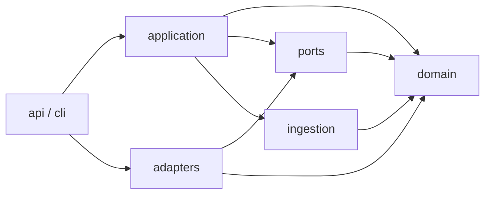

# Repository Structure

## Decision

The FolioAware MVP will use one Python distribution with a `src` layout. The
FastAPI service, synchronization CLI, and initial insight command share the
same domain contracts and application use cases, while Google Cloud code stays
behind typed ports.

This is intentionally smaller than a multi-application monorepo. A widget,
React wrapper, dashboard, or independently deployed insight worker will be
split out only when a working vertical slice demonstrates the need.

## Target layout

Paths marked **initial** belong to the first implementation foundation or
vertical slice. Paths marked **later** are reserved in this document but should
not be created until their feature is implemented.

```text
folio-aware/
├── .github/
│   └── workflows/
│       ├── ci.yml                         # current: quality and offline infra checks
│       ├── deploy-reusable.yml            # current: keyless image release
│       └── sync-reusable.yml              # current: keyless approved-content sync
├── deploy/
│   └── terraform/                         # current: non-applied Google foundation
│       ├── tests/                         # mocked provider policy tests
│       ├── backend.hcl.example            # synthetic remote-state shape
│       └── terraform.tfvars.example       # synthetic adopter inputs
├── docs/
│   ├── adr/                               # current: architecture decisions
│   ├── architecture.md                    # current: system boundaries and flow
│   ├── problem-statement.md               # current: scope and success criteria
│   ├── repository-structure.md            # current: this document
│   ├── api-and-data-contracts.md           # current
│   ├── evidence-policy.md                  # current
│   ├── infrastructure-permissions.md       # current: cloud trust boundaries
│   ├── threat-model.md                     # current
│   └── mvp-plan.md                         # current
├── evals/
│   └── fixtures/                           # initial: grounded/refusal cases
├── examples/
│   └── synthetic-portfolio/                # initial: public synthetic content
│       ├── content/
│       └── folioaware.yaml
├── schemas/
│   └── knowledge-source.schema.json        # initial: portable source schema
├── src/
│   └── folioaware/
│       ├── api/                            # initial: FastAPI transport
│       │   ├── dependencies.py
│       │   ├── errors.py
│       │   ├── main.py
│       │   └── routes/
│       ├── application/                    # deterministic use cases
│       │   ├── answer_question.py
│       │   ├── generate_insights.py
│       │   └── sync_knowledge.py
│       ├── domain/                         # initial: pure models and policies
│       │   ├── answers.py
│       │   ├── evidence.py
│       │   ├── knowledge.py
│       │   ├── sync.py
│       │   └── telemetry.py
│       ├── ports/                          # initial: dependency protocols
│       │   ├── embeddings.py
│       │   ├── generation.py
│       │   ├── knowledge_repository.py
│       │   └── question_repository.py
│       ├── adapters/
│       │   ├── local/                      # current: deterministic tests/demo
│       │   └── google/                     # current: Firestore and Vertex AI
│       ├── ingestion/                      # initial: parse, validate, chunk, hash
│       ├── security/                       # initial: redaction and input limits
│       ├── cli/                            # initial: sync command entry point
│       ├── analytics/                      # current: topic/intent rules
│       └── notifications/                  # later: owner delivery adapters
├── tests/
│   ├── contract/                           # port/adapter behavior contracts
│   ├── integration/                        # API and workflow boundaries
│   └── unit/                               # pure policy/use-case tests
├── .dockerignore                           # initial
├── .env.example                            # initial: names, no credentials
├── .gitignore                              # initial
├── Dockerfile                              # initial
├── LICENSE                                 # Apache License 2.0
├── README.md                               # current
├── pyproject.toml                          # initial: package and tool config
└── uv.lock                                 # initial: reproducible dependencies
```

The tree is a destination, not an instruction to create placeholders. A
directory is added only with the first real file that has a clear owner.

Deployment-specific IDs, portfolio content, analytics, real `.tfvars`, state,
and backend configuration belong to the adopter deployment, not this reusable
open-source repository.

## Boundary rules

### `domain`

Owns Pydantic domain models, value objects, enums, and deterministic evidence
policies. It must not import FastAPI, Firestore, Vertex AI, or concrete adapters.

### `application`

Owns use-case orchestration. It may depend on `domain` and `ports`, but not on
concrete adapters or HTTP types. The two initial use cases are answering a
question and synchronizing approved knowledge.

### `ports`

Owns small typed protocols for embeddings, generation, persistence, analytics,
and notifications. A port describes behavior needed by a use case; it does not
mirror an entire vendor SDK.

### `adapters`

Implements ports. `memory` provides deterministic local and test behavior.
`google` owns Firestore and Vertex AI SDK types and maps them to domain types.
No other package may import a Google persistence or model client directly.

### `api` and `cli`

These are entry points and composition roots. They validate transport-level
input, construct dependencies, invoke application use cases, and translate
known errors. They contain no retrieval, evidence, or synchronization policy.

### `ingestion`

Owns manifest loading, safe source-path resolution, schema validation, stable
chunking, and hashing. Only synchronization invokes ingestion; the public API
does not expose it.

### `security`

Owns reusable input limits and telemetry redaction. Authorization and cloud IAM
remain deployment concerns, while request-specific enforcement is called from
the entry point or application boundary.

### `analytics` and `notifications`

Analytics classifies privacy-reduced telemetry using owner-configured,
deterministic rules. The insight application use case writes aggregate records.
Notifications remain deferred. Neither may depend on or write through the
knowledge repository.

## Dependency direction



Dependencies point inward toward domain rules. The composition roots know both
use cases and concrete adapters so they can wire them together; use cases never
discover dependencies from global state.

## Test organization

- **Unit tests** exercise domain policies, chunking, hashing, redaction, and use
  cases with in-memory adapters.
- **Contract tests** define behavior that every implementation of a repository
  or model port must satisfy.
- **Integration tests** invoke FastAPI or the CLI across real application
  boundaries using local adapters. Google emulator/live-project tests, if
  introduced, must be explicitly selected and never run implicitly.
- **Evaluations** contain versioned question/evidence/expected-policy fixtures.
  They measure grounding behavior and are not replacements for deterministic
  tests.

## Configuration ownership

- Environment variables configure a deployed FolioAware instance.
- `.env.example` documents variable names and safe descriptions only.
- `folioaware.yaml` belongs to an adopting portfolio and declares approved
  sources and public citation metadata.
- Model names, embedding dimensions, prompt versions, thresholds, and retention
  settings are explicit configuration, not scattered constants.
- Application startup validates configuration and fails closed when required
  production settings are missing.

## Deliberately deferred structure

The MVP does not create `apps/`, `packages/`, `widget/`, `react/`, or a separate
insight-job project. Those boundaries would add multiple manifests, releases,
and CI paths before independent deployment or ownership exists. A future ADR
must justify the split using an actual packaging, runtime, or team boundary.
