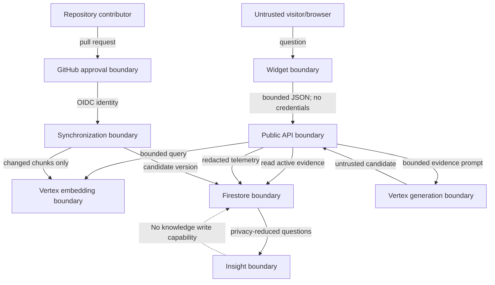

# Threat Model

## Status and scope

This threat model covers the planned single-tenant FolioAware deployment:

- the public FastAPI answer endpoint on Cloud Run;
- approved content and the synchronization CLI;
- Firestore knowledge, telemetry, synchronization, and insight data;
- Vertex AI embedding and generation calls;
- GitHub Actions authenticated with Workload Identity Federation; and
- the framework-independent widget on the independently hosted portfolio.

It describes required controls. A control is not considered implemented until
corresponding code, configuration, and tests exist.

The model uses STRIDE as an organizing tool and incorporates risks identified by
the [OWASP Top 10 for LLM and GenAI applications](https://genai.owasp.org/llm-top-10/)
and the [NIST Generative AI Profile](https://www.nist.gov/publications/artificial-intelligence-risk-management-framework-generative-artificial-intelligence).

## Security objectives

In priority order, FolioAware must:

1. Preserve the integrity of verified portfolio knowledge.
2. Prevent unsupported or incorrectly cited claims from reaching visitors.
3. Prevent visitor-derived data from entering verified knowledge.
4. Protect credentials, private configuration, and privacy-reduced telemetry.
5. Remain available within explicit request and cost limits.
6. Preserve an auditable record of knowledge synchronization and version use.

## Protected assets

| Asset | Required property |
| --- | --- |
| Approved portfolio content | Integrity, provenance, availability |
| Active knowledge-version pointer | Integrity, atomicity, auditability |
| Knowledge chunks and embeddings | Integrity, version consistency |
| Citation metadata | Integrity, safe public rendering |
| Visitor-question telemetry | Confidentiality, retention, separation |
| GitHub and Google identities | Confidentiality, least privilege |
| Model and application configuration | Integrity, confidentiality where sensitive |
| Prompts and evaluation policies | Integrity; no embedded secrets |
| API capacity and cloud budget | Availability, bounded consumption |
| Logs and synchronization history | Integrity, redaction, useful attribution |

## Actors

- **Normal visitor:** asks portfolio questions through the public frontend.
- **Malicious visitor or bot:** submits injection strings, oversized inputs,
  repeated requests, fabricated identifiers, or probes for private information.
- **Portfolio owner/contributor:** edits approved content and reviews changes;
  may make honest mistakes.
- **Compromised contributor or workflow:** attempts to poison sources, alter CI,
  activate an unsafe index, or misuse cloud identity.
- **Dependency or platform failure:** returns malformed output, times out, changes
  behavior, or becomes unavailable without an intentional attacker.
- **Cloud administrator:** can change IAM, networking, retention, or billing and
  is trusted only within documented administrative responsibility.

## Trust boundaries

Everything entering across a boundary is validated. Retrieved content and model
output remain untrusted even after an approved source has been ingested.

## Core architectural controls

- Only synchronization receives a knowledge-write capability.
- The public API receives read-only knowledge access and separate telemetry-write
  access.
- Analytics receives telemetry-read and insight-write capabilities, never
  knowledge-write access.
- The generation model receives no tools, credentials, network fetch capability,
  repository write capability, or arbitrary database access.
- A model cannot activate an index or construct public citation metadata.
- Candidate index activation uses a transaction and occurs only after required
  validation and evaluations succeed.
- Every external call has a timeout, bounded input/output, and explicit retry
  policy. No model-controlled retry loop exists.
- The widget stores no visitor data, validates every response at runtime,
  renders plain text, and permits only HTTPS or root-relative citations.
- CORS is an exact browser-origin policy, never treated as an abuse or cost
  control.
- Semantic answer caching is prohibited in the MVP. Provider-managed caches
  cannot establish correctness or evidence freshness.

## Threat register

Ratings describe risk before the listed controls are implemented.

| ID | Threat | STRIDE / LLM risk | Initial risk | Required controls | Safe failure |
| --- | --- | --- | --- | --- | --- |
| T01 | Visitor tells the model to ignore policy, reveal prompts, or invent experience | Tampering; prompt injection | High | Treat question as delimited data; fixed pipeline; no tools; structured output; evidence-ID validation; injection evaluations | Reject candidate or abstain |
| T02 | Approved content contains instructions that hijack generation | Tampering; indirect prompt injection | High | Treat evidence as quoted data; sanitize control characters; no tools; validate output; adversarial fixture tests | Reject candidate or fail sync evaluation |
| T03 | Malicious or mistaken content is added as verified knowledge | Tampering; data poisoning | High | Explicit manifest; protected review; schema and provenance checks; sync evaluation; immutable Git SHA; rollback | Candidate remains inactive |
| T04 | Model invents a citation ID, title, URL, metric, date, or skill | Improper output handling; misinformation | High | Model returns IDs only; application checks exact retrieved-set membership and builds citation metadata | Reject candidate or abstain |
| T05 | Weak nearest-neighbor result is treated as proof | Vector/embedding weakness | High | Active/public/verified prefilter; calibrated distance threshold; claim-specific rules; negative evaluations | `knowledge_gap` without generation |
| T06 | Concurrent or partial sync replaces good knowledge | Tampering; denial of service | High | Copy-on-write version; transactional compare-and-set activation; one active pointer; previous version retained | Previous version stays active |
| T07 | Removed or private content remains retrievable | Information disclosure; tampering | High | Version-scoped search; visibility and active filters; removal tests; no client-side Firestore access | Exclude result; fail closed |
| T08 | Public API writes visitor content into knowledge | Elevation of privilege; poisoning | Critical | Separate ports, collections, identities, and IAM; API has no knowledge-write dependency; invariant test | Operation impossible/denied |
| T09 | Raw identifiers or personal data enter telemetry or logs | Information disclosure | High | No IP persistence; redact before write; rotating HMAC session hash; log allowlist; retention; deletion procedure | Drop telemetry, preserve answer |
| T10 | Attacker extracts system prompts, credentials, project details, or private evidence | Information disclosure | High | No secrets in prompts; generic errors; redacted logs; Secret Manager/runtime identity; public-only retrieval | Safe error with request ID |
| T11 | Malicious citation URL produces script execution or unsafe navigation | Tampering; XSS/open navigation | High | Accept only HTTPS or root-relative URLs; application-owned metadata; frontend escapes text; no HTML from model | Reject source or candidate |
| T12 | Oversized or repeated requests create a model-cost or availability attack | Denial of service; unbounded consumption | High | Input/body limits; rate limits; concurrency and timeouts; max instances; bounded top-k/tokens; bot monitoring; budgets | `413`, `429`, or `503` |
| T13 | Forged session or feedback identifiers corrupt analytics | Spoofing; tampering | Medium | Treat IDs as untrusted; HMAC pseudonymization; idempotency; aggregation by distinct rotating hashes; never use analytics as facts | Ignore or deduplicate record |
| T14 | Compromised GitHub workflow obtains excessive cloud access | Elevation of privilege | Critical | WIF only; repository/owner/branch/workflow conditions; distinct least-privilege identities; pinned reviewed actions; protected environments | Authentication/authorization denied |
| T15 | Dependency or container supply chain is compromised | Supply chain | High | Lock dependencies; review updates; vulnerability scanning; minimal image; build provenance; pin CI actions by reviewed immutable reference where practical | CI blocks release |
| T16 | Model or Firestore timeout causes retries, duplicates, or inconsistent responses | Denial of service; repudiation | Medium | Bounded retries only for safe operations; idempotent writes; request IDs; typed timeouts; no fallback to unsupported answer | Structured `503` or safe answer without telemetry |
| T17 | Sensitive data is placed in source content and published as evidence | Information disclosure | High | Synthetic public fixtures; source review checklist; secret scanning; visibility rules; pre-publication review | Sync fails or source excluded |
| T18 | Logs contain questions, evidence, prompts, tokens, or vendor payloads | Information disclosure | High | Structured allowlisted logging; no raw bodies by default; sanitization; restricted log access and retention | Record code/metadata only |
| T19 | Analytics suggests claiming an unsupported skill | Misinformation; excessive agency | High | Fixed recommendation enum; language distinguishes interest from evidence; no knowledge-write port; owner approval | Suggest study/build/leave unavailable |
| T20 | Configuration drift changes model, threshold, prompt, or index compatibility silently | Tampering; repudiation | Medium | Version all relevant configuration; validate at startup/sync; include versions in safe traces and evaluations | Refuse incompatible index/request |
| T21 | A malformed or malicious API response executes script or creates unsafe navigation in the portfolio | Improper output handling; XSS | High | Exact bounded response validation; plain-text DOM writes; safe citation URL policy; production-bundle browser tests | Generic recoverable widget error |
| T22 | A cached answer survives corrected, removed, or newly private evidence | Tampering; stale evidence | High | No semantic answer cache in MVP; future cache keys must include knowledge, model, prompt, and policy versions and revalidate citation membership | Bypass or evict cache; retrieve active evidence |
| T23 | Provider prompt/prefix caching changes retention, region, or privacy assumptions | Information disclosure; supply chain | Medium | Make provider cache use an explicit pre-deployment decision; document data handling, region, TTL, and disable controls; never depend on it for correctness | Disable provider cache |
| T24 | CORS is mistaken for authentication or cost protection | Spoofing; denial of service | High | Exact origin allowlist plus independent server-side rate limits, budgets, alerts, timeouts, and maximum instances before deployment | `429`/`503`; contain spend |

## STRIDE summary

### Spoofing

The public visitor is intentionally unauthenticated, so `sessionId` proves
nothing. GitHub and deployment identities require cryptographic short-lived
credentials and restrictive federation conditions. Owner/admin routes are not
part of the public MVP.

### Tampering

Primary tampering targets are approved sources, workflows, model candidates,
citations, and the active-version pointer. Git review, deterministic hashes,
copy-on-write versions, transactions, and post-model validation provide the
main defenses.

### Repudiation

Request IDs, Git commit SHAs, sync-run records, knowledge versions, model/prompt
versions, and sanitized error codes provide audit context. The system does not
claim that an anonymous visitor identity is attributable to a person.

### Information disclosure

Only public evidence is retrievable. Credentials never enter the browser or
prompt. Errors and logs use allowlisted fields. Telemetry is privacy-reduced,
not promised to be perfectly anonymous.

### Denial of service

Question length, body size, top-k, input/output tokens, model calls, timeouts,
retries, rate limits, and Cloud Run scale are bounded. Billing alerts are
monitoring, not hard spending caps.

### Elevation of privilege

Capabilities and IAM are split by workflow. The public API cannot gain
knowledge-write access through model output because the model has no tool and
the API process is not given the corresponding application port or cloud role.

## Prompt-injection position

Prompt injection cannot be solved by wording alone. System instructions help
shape behavior, but Google explicitly notes that they do not fully prevent
jailbreaks or leakage. FolioAware therefore assumes an injection may influence
the candidate text and limits the resulting impact through:

1. no model tools or write permissions;
2. application-owned retrieval and sufficiency decisions;
3. a bounded evidence set with opaque evidence IDs;
4. structured candidate output;
5. exact evidence-ID membership checks;
6. application-owned citation metadata; and
7. rejection or abstention on any validation failure.

See [Vertex AI system instruction guidance](https://cloud.google.com/vertex-ai/generative-ai/docs/learn/prompts/system-instruction-introduction)
and [OWASP excessive agency guidance](https://genai.owasp.org/llmrisk/llm062025-excessive-agency/).

## Logging and observability policy

Allowed default log fields:

- request ID;
- route and status code;
- latency buckets;
- answer status;
- knowledge, model, prompt, schema, and policy versions;
- retrieved count and coarse threshold decision;
- sanitized error code; and
- sync counts and Git commit SHA.

Disallowed default log fields:

- raw question or session ID;
- IP address or full user agent;
- evidence content or complete model prompt/response;
- embedding vector;
- credential, authorization header, or environment dump; and
- raw vendor exception payload.

Debug logging must not weaken these rules in production.

## Security verification gates

Before the local MVP is considered complete, automated tests must cover:

- direct injection in visitor questions;
- indirect injection in approved evidence;
- invented and mismatched citation IDs;
- weak and empty retrieval;
- unsupported skill, metric, date, and deployment claims;
- private, inactive, removed, and wrong-version evidence;
- oversized input and malformed model output;
- telemetry-to-knowledge contamination attempts;
- failed and concurrent synchronization;
- model timeout and repository failure; and
- secret/private-data scanning of public fixtures;
- malicious widget answer text, unsafe citation URLs, and malformed responses;
- widget keyboard, responsive, and automated accessibility behavior; and
- bundle checks for credentials, persistence APIs, unsafe HTML, and size.

Before cloud deployment, additionally verify IAM permissions, WIF conditions,
CORS, rate limiting, budgets/alerts, retention, redacted logs, dependency/image
scans, rollback, and an abuse smoke test.

## Residual risks

Even with these controls:

- semantic similarity and claim support cannot be perfectly measured;
- a model may produce persuasive wording that overstates evidence;
- redaction may miss personal information or remove useful text;
- an approved contributor can intentionally approve false information;
- compromised cloud/GitHub administrators can bypass application controls;
- rate limits cannot guarantee a fixed bill under every attack; and
- third-party platform behavior and pricing can change.
- automated accessibility rules cannot replace manual keyboard and assistive
  technology testing in an adopter's complete page.

These risks require evaluation, monitoring, least privilege, human review, and
periodic threat-model revision rather than claims of perfect safety.

## Review triggers

Revisit this document when adding a model tool, web browsing, owner dashboard,
new content adapter, multi-tenancy, cross-session memory, automated pull
requests, a new deployment identity, private evidence, answer or provider
caching, persistent browser storage, or a new data processor.

